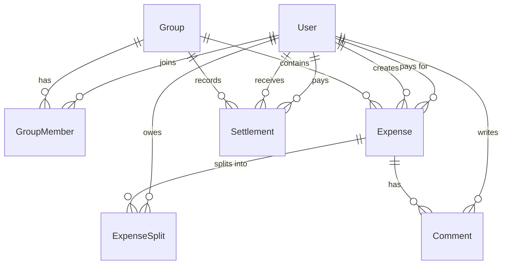

# AI_CONTEXT.md — Splitree (Splitwise Clone)

> **Source of Truth**: This file contains the complete working context used to build Splitree.
> Any developer or AI agent should be able to read this file and reconstruct the same application.
> Updated continuously as the project evolves.

---

## Table of Contents

1. [Product Understanding](#1-product-understanding)
2. [Product Scope](#2-product-scope)
3. [User Personas](#3-user-personas)
4. [Core Workflows](#4-core-workflows)
5. [Implementation Decisions](#5-implementation-decisions)
6. [Engineering Requirements](#6-engineering-requirements)
7. [Tech Stack](#7-tech-stack)
8. [Database Schema](#8-database-schema)
9. [API Design](#9-api-design)
10. [Frontend Structure](#10-frontend-structure)
11. [Deployment Plan](#11-deployment-plan)
12. [Testing Plan](#12-testing-plan)
13. [Known Tradeoffs & Limitations](#13-known-tradeoffs--limitations)
14. [Prompts & AI Responses](#14-prompts--ai-responses)
15. [Changes Made During Implementation](#15-changes-made-during-implementation)

---

## 1. Product Understanding

### What is Splitwise?
Splitwise is a bill-splitting and expense-sharing application. It allows groups of people (friends, roommates, travel groups) to:
- Track shared expenses
- Calculate who owes whom
- Record settlements/payments
- Keep a running balance ledger

### Key Behaviours Reverse-Engineered
- Users join groups; expenses exist within groups
- Every expense has one payer and multiple participants
- The app tracks the net balance between every pair of users in a group
- Balances are recalculated from raw expense and settlement records (not stored as a running counter)
- Settlements reduce balances but are separate transaction records
- Comments are attached to individual expenses (not a global group chat)

---

## 2. Product Scope

### In Scope (MVP — Splitree)
| Feature | Status |
|---|---|
| Email + password authentication | ✅ In scope |
| JWT-based session management | ✅ In scope |
| Create and manage groups | ✅ In scope |
| Invite members by email (existing users only) | ✅ In scope |
| Remove members (creator only) | ✅ In scope |
| Leave group (if zero balance) | ✅ In scope |
| Add expenses with 4 split types | ✅ In scope |
| Edit expenses | ✅ In scope |
| Soft-delete expenses | ✅ In scope |
| Past-dated expenses | ✅ In scope |
| Expense comment thread (real-time) | ✅ In scope |
| Pairwise balance display per group | ✅ In scope |
| Net balance summary per user | ✅ In scope |
| Record settlements (full or partial) | ✅ In scope |
| Dashboard: overall + group-wise balances | ✅ In scope |

### Out of Scope
- Email notifications / invitations
- Receipt scanning / image uploads
- Currency conversion
- Recurring expenses
- Mobile app (iOS/Android)
- Advanced analytics / reports
- Debt simplification algorithm
- Multiple payers per expense
- Reactions on comments
- Edit / delete comments
- Avatar / profile pictures
- Admin roles inside groups (creator has special privileges only)

---

## 3. User Personas

**Primary persona**: General user with basic technical knowledge.
- Uses the app to track shared expenses with friends, roommates, or travel companions.
- Expects a clean UI with clear balance indicators.
- Wants to know "what do I owe" and "who owes me" at a glance.

---

## 4. Core Workflows

### 4.1 Registration & Login
1. User visits `/register`, fills in name, email, password.
2. Password is hashed (bcrypt) server-side; user record created.
3. Server returns JWT access token.
4. User visits `/login`, enters credentials.
5. Server validates password, returns JWT.
6. Token stored in `localStorage` on the client.
7. All protected API calls send token in `Authorization: Bearer <token>` header.
8. Token is long-lived (e.g., 7 days). No refresh token for MVP.

### 4.2 Group Creation & Management
1. Authenticated user creates a group with name + optional description.
2. Creator is automatically added as a member.
3. Creator can add other **existing** registered users by their email address.
4. Creator can remove any member.
   - Removal does not delete historical expense records.
   - Removed member's split data remains in `expense_splits` for audit.
5. Any member can leave a group if their net balance within the group is zero (no outstanding debts owed or owed to them).
6. If a member has any outstanding balance (positive or negative), they must settle before leaving.

### 4.3 Adding an Expense
1. Any group member navigates to `/groups/:id/expenses/new`.
2. Fills in: title, amount, expense_date, paid_by (dropdown of members), split_type, notes.
3. Selects participants (can be entire group or a subset).
4. Depending on split_type:
   - **EQUAL**: System divides `amount / participant_count` equally.
   - **UNEQUAL**: User manually enters each participant's owed amount. Sum must equal total amount.
   - **PERCENTAGE**: User enters each participant's percentage. Sum must equal 100%.
   - **SHARE**: User assigns share units per participant. System computes `(shares / total_shares) * amount` per person.
5. Server validates totals, saves `expenses` + `expense_splits` records.
6. Payer's split record is their owed amount minus what they paid (net).
   - **Note**: The payer's entry in `expense_splits` still records what they "owe" based on the split. Balance computation handles the fact that they paid the full amount separately.

### 4.4 Balance Calculation Logic
Balances are computed dynamically from `expense_splits` and `settlements`. They are **never stored** — always recalculated on demand.

**Step 1 — Record splits at expense creation time:**

For every expense, we store one row in `expense_splits` per participant.
The `amount` field represents how much that participant **owes** toward this expense.

Example: A pays ₹90 for A, B, C split equally.
- `expense_splits` rows: A → ₹30, B → ₹30, C → ₹30
- The `expense.paidBy = A` field tells us who fronted the money.

When computing balances, we skip the row where `expense_splits.userId = expense.paidBy` (the payer doesn't owe themselves).
This means the effective balance impact is: **B owes A ₹30** and **C owes A ₹30**.

**Step 2 — Compute pairwise balance for users A and B in a group:**

```
// Raw debt: how much does A owe B across all expenses B paid?
raw_A_owes_B =
  SUM(expense_splits.amount)
  WHERE expense_splits.userId = A
    AND expense.paidBy = B
    AND expense.groupId = <groupId>
    AND expense.isDeleted = false
    AND expense_splits.userId != expense.paidBy  -- skip payer's own row

// Raw debt: how much does B owe A across all expenses A paid?
raw_B_owes_A =
  SUM(expense_splits.amount)
  WHERE expense_splits.userId = B
    AND expense.paidBy = A
    AND expense.groupId = <groupId>
    AND expense.isDeleted = false
    AND expense_splits.userId != expense.paidBy

// Net settlements between A and B
total_A_paid_B = SUM(settlements.amount) WHERE payerId = A AND receiverId = B AND groupId = <groupId>
total_B_paid_A = SUM(settlements.amount) WHERE payerId = B AND receiverId = A AND groupId = <groupId>

// Final net: positive = A owes B, negative = B owes A
net = raw_A_owes_B - raw_B_owes_A - total_A_paid_B + total_B_paid_A
```

**Step 3 — Interpret the net value:**
- If `net > 0`: A owes B `net` amount → show "You owe B: ₹net"
- If `net < 0`: B owes A `|net|` amount → show "B owes you: ₹|net|"
- If `net = 0`: fully settled → not shown

**Step 4 — Dashboard total:**

Sum the user's net balance across all groups they belong to.

### 4.5 Editing an Expense
**Authorization** (updated from initial draft):
- The **expense creator** can edit their own expense.
- The **group creator** can edit any expense in the group.
- Other members have **view-only** access.

1. Authorized user re-submits the full expense form.
2. Server deletes existing `expense_splits` for that expense and recalculates fresh splits.
3. Balance is recalculated on the fly from the updated records.

### 4.6 Deleting an Expense
**Authorization** (updated from initial draft):
- The **expense creator** can delete their own expense.
- The **group creator** can delete any expense in the group.
- Other members have **view-only** access.

1. Authorized user triggers delete.
2. Server sets `is_deleted = true` on the expense record (soft delete).
3. Deleted expenses are excluded from all balance calculations.
4. Deleted expenses are hidden from the active expense list but retained in the DB.

### 4.7 Recording a Settlement
1. Either the payer or receiver can record a settlement.
2. User visits `/groups/:id/settle`.
3. Fills in: payer, receiver, amount, date, optional notes.
4. Partial amounts allowed (settlement_amount < outstanding balance).
5. Settlement is recorded as a separate `settlements` row.
6. Balances are recalculated immediately.

### 4.8 Expense Comments (Real-time Chat)
1. User opens `/groups/:id/expenses/:expenseId`.
2. Sees the expense details and a comment thread below.
3. Types a comment and submits.
4. Server saves the comment, emits a Socket.io event to all clients in the room `expense:<expenseId>`.
5. All users currently viewing the same expense receive the new comment in real-time without refresh.

---

## 5. Implementation Decisions

| Decision | Choice | Reason |
|---|---|---|
| Auth strategy | JWT, long-lived (7 days), no refresh | MVP simplicity |
| Token storage | `localStorage` | Simple for MVP; aware of XSS risk |
| Primary keys | UUID v4 | Avoids enumerable IDs, safer for public APIs |
| Balance computation | Dynamic query (not cached) | Consistency; no risk of stale counters |
| Expense deletion | Soft delete (`is_deleted` flag) | Audit trail, no data loss |
| Real-time | Socket.io (WebSocket) | Per-expense rooms for comment broadcast |
| ORM | Prisma | Type-safe, good PostgreSQL support, clear migrations |
| Split validation | Server-side | Never trust client-side totals |
| Group leave rule | Only if net balance = 0 | Prevents data inconsistency |
| Member removal | Historical data preserved | Fair audit trail |
| Payer in splits | Payer's own split entry is excluded from balance calc | Prevents double-counting |
| Category field | Omitted for MVP | Time constraint |

---

## 6. Engineering Requirements

### Authorization Rules
- All routes except `/api/auth/*` require a valid JWT.
- Only group members can: view group data, create expenses, add comments, view balances, record settlements.
- Only the **group creator** can: remove other members, delete the group, edit/delete **any** expense.
- The **expense creator** can: edit or delete their **own** expense.
- All other members: view-only on expenses they did not create.
- Any member can: add other registered users to the group, leave the group (only if their net balance = 0).

### Validation Rules
- `EQUAL`: No additional input needed. System divides amount equally among participants.
- `UNEQUAL`: Sum of all participant amounts must equal expense total (within $0.01 rounding tolerance).
- `PERCENTAGE`: Sum of all percentages must equal 100 (within 0.01 tolerance).
- `SHARE`: Each participant must have at least 1 share. Computed amount = `(participant_shares / total_shares) * total_amount`.
- Settlement amount must be > 0.
- Expense amount must be > 0.
- Expense must have at least 2 participants.

### Data Integrity
- All monetary values stored as `Decimal(10, 2)` in Prisma/PostgreSQL.
- Rounding: computed splits rounded to 2 decimal places. Any rounding remainder added to the payer's own split entry to keep total exact.

---

## 7. Tech Stack

| Layer | Technology |
|---|---|
| Frontend | React 18, Vite, Tailwind CSS v3 |
| Routing (FE) | React Router v6 |
| State Management | React Context API + `useState`/`useEffect` |
| HTTP Client | Axios |
| Real-time (FE) | socket.io-client |
| Backend | Node.js 20, Express 5 |
| Real-time (BE) | Socket.io |
| ORM | Prisma 5 |
| Database | PostgreSQL 15 (hosted on Neon) |
| Auth | JSON Web Tokens (`jsonwebtoken`), bcrypt |
| Validation | Zod (server-side schema validation) |
| Deployment (FE) | Vercel |
| Deployment (BE) | Render (free tier) |
| Deployment (DB) | Neon (free tier, persistent) |

---

## 8. Database Schema

### Prisma Schema (`prisma/schema.prisma`)

```prisma
generator client {
  provider = "prisma-client-js"
}

datasource db {
  provider = "postgresql"
  url      = env("DATABASE_URL")
}

model User {
  id            String   @id @default(uuid())
  name          String
  email         String   @unique
  passwordHash  String
  createdAt     DateTime @default(now())

  // Relations
  groupsCreated     Group[]          @relation("GroupCreator")
  groupMemberships  GroupMember[]
  expensesPaid      Expense[]        @relation("ExpensePayer")
  expensesCreated   Expense[]        @relation("ExpenseCreator")
  expenseSplits     ExpenseSplit[]
  settlementsPaid   Settlement[]     @relation("SettlementPayer")
  settlementsReceived Settlement[]   @relation("SettlementReceiver")
  comments          Comment[]
}

model Group {
  id          String   @id @default(uuid())
  name        String
  description String?
  createdBy   String
  createdAt   DateTime @default(now())

  // Relations
  creator     User          @relation("GroupCreator", fields: [createdBy], references: [id])
  members     GroupMember[]
  expenses    Expense[]
  settlements Settlement[]
}

model GroupMember {
  id       String   @id @default(uuid())
  groupId  String
  userId   String
  joinedAt DateTime @default(now())

  // Relations
  group Group @relation(fields: [groupId], references: [id], onDelete: Cascade)
  user  User  @relation(fields: [userId], references: [id], onDelete: Cascade)

  @@unique([groupId, userId])
}

model Expense {
  id          String      @id @default(uuid())
  title       String
  amount      Decimal     @db.Decimal(10, 2)
  paidBy      String
  splitType   SplitType
  expenseDate DateTime
  notes       String?
  groupId     String
  createdBy   String
  createdAt   DateTime    @default(now())
  isDeleted   Boolean     @default(false)

  // Relations
  payer    User           @relation("ExpensePayer", fields: [paidBy], references: [id])
  creator  User           @relation("ExpenseCreator", fields: [createdBy], references: [id])
  group    Group          @relation(fields: [groupId], references: [id], onDelete: Cascade)
  splits   ExpenseSplit[]
  comments Comment[]
}

enum SplitType {
  EQUAL
  UNEQUAL
  PERCENTAGE
  SHARE
}

model ExpenseSplit {
  id         String   @id @default(uuid())
  expenseId  String
  userId     String
  amount     Decimal  @db.Decimal(10, 2)
  shareValue Decimal? @db.Decimal(10, 2)
  percentage Decimal? @db.Decimal(5, 2)
  createdAt  DateTime @default(now())

  // Relations
  expense Expense @relation(fields: [expenseId], references: [id], onDelete: Cascade)
  user    User    @relation(fields: [userId], references: [id], onDelete: Cascade)

  @@unique([expenseId, userId])
}

model Settlement {
  id             String   @id @default(uuid())
  groupId        String
  payerId        String
  receiverId     String
  amount         Decimal  @db.Decimal(10, 2)
  settlementDate DateTime
  notes          String?
  createdAt      DateTime @default(now())

  // Relations
  group    Group @relation(fields: [groupId], references: [id], onDelete: Cascade)
  payer    User  @relation("SettlementPayer", fields: [payerId], references: [id])
  receiver User  @relation("SettlementReceiver", fields: [receiverId], references: [id])
}

model Comment {
  id        String   @id @default(uuid())
  expenseId String
  userId    String
  text      String
  createdAt DateTime @default(now())

  // Relations
  expense Expense @relation(fields: [expenseId], references: [id], onDelete: Cascade)
  user    User    @relation(fields: [userId], references: [id], onDelete: Cascade)
}
```

### Entity Relationships

```
User ─────< GroupMember >───── Group
User ─────< Expense (paidBy)
User ─────< Expense (createdBy)
User ─────< ExpenseSplit
User ─────< Settlement (payer)
User ─────< Settlement (receiver)
User ─────< Comment
Group ────< Expense
Group ────< Settlement
Expense ──< ExpenseSplit
Expense ──< Comment
```

---

## 9. API Design

**Base URL**: `https://<backend>.onrender.com/api`
**Auth header**: `Authorization: Bearer <jwt_token>` (required for all routes except auth)

---

### 9.1 Authentication

#### `POST /api/auth/register`
**Body**:
```json
{ "name": "string", "email": "string", "password": "string" }
```
**Response 201**:
```json
{ "token": "jwt_string", "user": { "id": "uuid", "name": "string", "email": "string" } }
```

#### `POST /api/auth/login`
**Body**:
```json
{ "email": "string", "password": "string" }
```
**Response 200**:
```json
{ "token": "jwt_string", "user": { "id": "uuid", "name": "string", "email": "string" } }
```

#### `GET /api/auth/me`
**Response 200**:
```json
{ "id": "uuid", "name": "string", "email": "string", "createdAt": "ISO8601" }
```

---

### 9.2 Users

#### `GET /api/users/search?email=<email>`
Search for a registered user by exact email (used when adding to a group).
**Response 200**:
```json
{ "id": "uuid", "name": "string", "email": "string" }
```
**Response 404**: User not found.

---

### 9.3 Groups

#### `POST /api/groups`
**Body**:
```json
{ "name": "string", "description": "string | null" }
```
**Response 201**:
```json
{ "id": "uuid", "name": "string", "description": "string", "createdBy": "uuid", "createdAt": "ISO8601" }
```

#### `GET /api/groups`
Returns all groups the authenticated user is a member of.
**Response 200**:
```json
[{ "id": "uuid", "name": "string", "description": "string", "createdBy": "uuid", "createdAt": "ISO8601", "memberCount": 3 }]
```

#### `GET /api/groups/:id`
Returns group details including members list.
**Response 200**:
```json
{
  "id": "uuid",
  "name": "string",
  "description": "string",
  "createdBy": "uuid",
  "createdAt": "ISO8601",
  "members": [{ "id": "uuid", "name": "string", "email": "string", "joinedAt": "ISO8601" }]
}
```

#### `PUT /api/groups/:id`
Creator only. Update group name or description.
**Body**:
```json
{ "name": "string", "description": "string | null" }
```
**Response 200**: Updated group object.

#### `DELETE /api/groups/:id`
Creator only. Deletes group and cascades to all related records.
**Response 204**: No content.

#### `POST /api/groups/:id/members`
Any member. Add an existing user by email.
**Body**:
```json
{ "email": "string" }
```
**Response 201**:
```json
{ "message": "Member added", "user": { "id": "uuid", "name": "string", "email": "string" } }
```
**Response 404**: User not found.
**Response 409**: User already a member.

#### `DELETE /api/groups/:id/members/:userId`
Creator only — removes another member.
Any member — removes themselves (leave group), only if net balance = 0.
**Response 200**:
```json
{ "message": "Member removed" }
```
**Response 400**: Cannot leave with outstanding balance.
**Response 403**: Not authorized.

---

### 9.4 Expenses

#### `POST /api/groups/:groupId/expenses`
**Body**:
```json
{
  "title": "string",
  "amount": 100.00,
  "paidBy": "uuid",
  "splitType": "EQUAL | UNEQUAL | PERCENTAGE | SHARE",
  "expenseDate": "ISO8601",
  "notes": "string | null",
  "participants": [
    { "userId": "uuid", "amount": 33.33 },
    { "userId": "uuid", "amount": 33.33 },
    { "userId": "uuid", "amount": 33.34 }
  ]
}
```
Note: For EQUAL splits, the `participants` array only needs `userId` fields; server computes amounts.
For PERCENTAGE, pass `percentage` instead of `amount`. For SHARE, pass `shareValue`.

**Full participant object variants by split type**:
- EQUAL: `[{ "userId": "uuid" }]`
- UNEQUAL: `[{ "userId": "uuid", "amount": 50.00 }]`
- PERCENTAGE: `[{ "userId": "uuid", "percentage": 50.00 }]`
- SHARE: `[{ "userId": "uuid", "shareValue": 2 }]`

**Response 201**: Full expense object with splits.

#### `GET /api/groups/:groupId/expenses`
Returns all non-deleted expenses for a group, newest first.
**Response 200**:
```json
[{
  "id": "uuid",
  "title": "string",
  "amount": "100.00",
  "paidBy": { "id": "uuid", "name": "string" },
  "splitType": "EQUAL",
  "expenseDate": "ISO8601",
  "notes": "string",
  "createdAt": "ISO8601",
  "splits": [{ "userId": "uuid", "userName": "string", "amount": "33.33" }]
}]
```

#### `GET /api/groups/:groupId/expenses/:expenseId`
Returns single expense with splits and comments.
**Response 200**: Full expense object + `comments` array.

#### `PUT /api/groups/:groupId/expenses/:expenseId`
**Authorization**: Expense creator OR group creator only. Returns 403 for all others.
Re-submit full expense body. Deletes old `expense_splits`, recalculates new ones.
**Body**: Same as POST.
**Response 200**: Updated expense object.
**Response 403**: Not authorized to edit this expense.

#### `DELETE /api/groups/:groupId/expenses/:expenseId`
**Authorization**: Expense creator OR group creator only. Returns 403 for all others.
Soft-delete — sets `is_deleted = true`.
**Response 200**:
```json
{ "message": "Expense deleted" }
```
**Response 403**: Not authorized to delete this expense.

---

### 9.5 Balances

#### `GET /api/groups/:groupId/balances`
Returns pairwise balances for the group from the perspective of the current user.
**Response 200**:
```json
{
  "userBalance": 150.00,
  "balances": [
    { "userId": "uuid", "userName": "string", "youOwe": 0, "theyOwe": 150.00 },
    { "userId": "uuid", "userName": "string", "youOwe": 50.00, "theyOwe": 0 }
  ]
}
```
`userBalance` = net balance for current user (positive = net owed to you, negative = net you owe).

---

### 9.6 Settlements

#### `POST /api/groups/:groupId/settlements`
**Body**:
```json
{
  "payerId": "uuid",
  "receiverId": "uuid",
  "amount": 50.00,
  "settlementDate": "ISO8601",
  "notes": "string | null"
}
```
**Response 201**: Settlement record.

#### `GET /api/groups/:groupId/settlements`
Returns all settlements for a group, newest first.
**Response 200**:
```json
[{
  "id": "uuid",
  "payer": { "id": "uuid", "name": "string" },
  "receiver": { "id": "uuid", "name": "string" },
  "amount": "50.00",
  "settlementDate": "ISO8601",
  "notes": "string",
  "createdAt": "ISO8601"
}]
```

---

### 9.7 Comments

#### `POST /api/expenses/:expenseId/comments`
**Body**:
```json
{ "text": "string" }
```
**Response 201**:
```json
{ "id": "uuid", "expenseId": "uuid", "user": { "id": "uuid", "name": "string" }, "text": "string", "createdAt": "ISO8601" }
```
After saving, server emits Socket.io event `new_comment` to room `expense:<expenseId>`.

#### `GET /api/expenses/:expenseId/comments`
Returns all comments for an expense, oldest first.
**Response 200**:
```json
[{ "id": "uuid", "user": { "id": "uuid", "name": "string" }, "text": "string", "createdAt": "ISO8601" }]
```

---

### 9.8 Dashboard

#### `GET /api/dashboard`
Returns overall balance summary for the current user across all groups, plus a recent activity feed.
**Response 200**:
```json
{
  "totalBalance": 200.00,
  "totalOwed": 350.00,
  "totalOwe": 150.00,
  "recentExpenses": [{
    "id": "uuid",
    "title": "string",
    "amount": "100.00",
    "groupName": "string",
    "paidByName": "string",
    "expenseDate": "ISO8601"
  }],
  "groupBalances": [{
    "groupId": "uuid",
    "groupName": "string",
    "balance": 150.00
  }],
  "recentActivity": [{
    "type": "expense | settlement",
    "description": "Rahul added \"Dinner\" ₹1200",
    "groupName": "string",
    "createdAt": "ISO8601"
  }]
}
```

**Activity feed logic**: Fetch the 10 most recent events (expenses created + settlements recorded) across all the user's groups, sorted by `createdAt` descending. Format each as a human-readable description string on the server.

---

### 9.9 Socket.io Events

| Event | Direction | Room | Payload |
|---|---|---|---|
| `join_expense` | Client → Server | — | `{ expenseId }` |
| `leave_expense` | Client → Server | — | `{ expenseId }` |
| `new_comment` | Server → Client | `expense:<expenseId>` | Full comment object |

Client joins room on mount: `socket.emit('join_expense', { expenseId })`.
Client leaves room on unmount: `socket.emit('leave_expense', { expenseId })`.

---

## 10. Frontend Structure

### Directory Layout
```
frontend/
├── public/
├── src/
│   ├── api/              # Axios instance + API call functions
│   │   ├── axios.js
│   │   ├── auth.js
│   │   ├── groups.js
│   │   ├── expenses.js
│   │   ├── balances.js
│   │   ├── settlements.js
│   │   ├── comments.js
│   │   └── dashboard.js
│   ├── components/       # Reusable UI components
│   │   ├── Navbar.jsx
│   │   ├── ProtectedRoute.jsx
│   │   ├── ExpenseCard.jsx
│   │   ├── BalanceSummary.jsx
│   │   ├── MemberList.jsx
│   │   ├── CommentThread.jsx
│   │   ├── SplitForm.jsx
│   │   ├── SettlementForm.jsx
│   │   └── ActivityFeed.jsx  # Recent activity list on dashboard
│   ├── context/
│   │   └── AuthContext.jsx   # JWT + user state
│   ├── hooks/
│   │   └── useSocket.js      # Socket.io hook
│   ├── pages/
│   │   ├── Login.jsx
│   │   ├── Register.jsx
│   │   ├── Dashboard.jsx
│   │   ├── GroupCreate.jsx
│   │   ├── GroupDetail.jsx
│   │   ├── ExpenseCreate.jsx
│   │   ├── ExpenseDetail.jsx
│   │   ├── Settle.jsx
│   │   └── Profile.jsx
│   ├── App.jsx
│   ├── main.jsx
│   └── index.css
├── .env.example
├── index.html
├── tailwind.config.js
└── vite.config.js
```

### Routes (React Router v6)
```
/login               → Login.jsx
/register            → Register.jsx
/ (dashboard)        → Dashboard.jsx [Protected]
/groups/new          → GroupCreate.jsx [Protected]
/groups/:id          → GroupDetail.jsx [Protected]
/groups/:id/expenses/new → ExpenseCreate.jsx [Protected]
/groups/:id/expenses/:expenseId → ExpenseDetail.jsx [Protected]
/groups/:id/settle   → Settle.jsx [Protected]
/profile             → Profile.jsx [Protected]
```

### Auth Context
`AuthContext.jsx` stores: `{ user, token, login(), logout() }`.
On app load, reads token from `localStorage`. If valid, sets user state via `GET /api/auth/me`.

### State Management Approach
- No Redux or Zustand for MVP.
- Each page fetches its own data via `useEffect`.
- `AuthContext` is the only global state.
- Socket.io managed via `useSocket` custom hook (singleton connection per session).

---

## 11. Deployment Plan

### Backend (Render)
- Service type: Web Service
- Build command: `npm install && npx prisma generate && npx prisma migrate deploy`
- Start command: `node src/index.js`
- Environment variables: `DATABASE_URL`, `JWT_SECRET`, `CLIENT_URL`, `PORT`
- Auto-deploy on push to `main` branch.

### Frontend (Vercel)
- Framework preset: Vite
- Build command: `npm run build`
- Output directory: `dist`
- Environment variables: `VITE_API_URL`, `VITE_SOCKET_URL`
- Auto-deploy on push to `main` branch.

### Database (Neon)
- PostgreSQL 15
- Connection string stored as `DATABASE_URL` in Render environment.
- Migrations run automatically on each backend deploy.
- Free tier: persistent storage, no auto-suspend for 7 days of inactivity.

### Repository Structure
```
Splitree/                  (root monorepo)
├── backend/
│   ├── prisma/
│   │   ├── schema.prisma
│   │   └── seed.js           # Demo seed data (Alice, Bob, Charlie + Goa Trip group)
│   ├── src/
│   │   ├── routes/
│   │   ├── middleware/
│   │   ├── utils/
│   │   └── index.js
│   ├── tests/
│   │   ├── auth.test.js      # Jest + Supertest: register, login, me
│   │   ├── expenses.test.js  # All 4 split type calculations
│   │   └── balances.test.js  # Pairwise balance calculation logic
│   ├── .env.example
│   └── package.json
├── frontend/
│   ├── src/
│   ├── .env.example
│   └── package.json
├── AI_CONTEXT.md
├── BUILD_PLAN.md
└── README.md
```

### ER Diagram (Mermaid)



---

## 12. Testing Plan

### Automated Tests (Jest + Supertest)

Test files live in `backend/tests/`. Run with `npm test`.

#### `auth.test.js`
| Test | Assertion |
|---|---|
| POST /auth/register with valid body | 201, token returned |
| POST /auth/register with duplicate email | 409 |
| POST /auth/login with correct password | 200, token returned |
| POST /auth/login with wrong password | 401 |
| GET /auth/me with valid token | 200, user object |
| GET /auth/me with no token | 401 |

#### `expenses.test.js` — Split Calculation Logic
| Test | Assertion |
|---|---|
| EQUAL: $90 among 3 users | Each split = $30.00 |
| EQUAL: $10 among 3 users (rounding) | Splits = $3.33, $3.33, $3.34 (total = $10) |
| UNEQUAL: amounts sum to total | 201, splits stored as given |
| UNEQUAL: amounts do not sum to total | 400, validation error |
| PERCENTAGE: shares sum to 100 | 201, computed amounts correct |
| PERCENTAGE: shares do not sum to 100 | 400, validation error |
| SHARE: 2 shares + 1 share on $30 | Splits = $20, $10 |
| SHARE: zero share value | 400, each participant must have ≥ 1 share |

#### `balances.test.js` — Balance Calculation
| Test | Assertion |
|---|---|
| A pays $90, split equally among A, B, C | B owes A $30, C owes A $30 |
| After settlement of $20 by B | B owes A $10 |
| After full settlement | Net = 0 |
| Soft-deleted expense excluded | Balance = 0 after delete |
| Partial settlement recorded | Balance reduced by settlement amount only |

### Manual Testing Checklist (per feature)

| Test Case | Expected Result |
|---|---|
| Register new user | 201, JWT returned |
| Login with correct credentials | 200, JWT returned |
| Login with wrong password | 401 |
| Access protected route without token | 401 |
| Create group | 201, creator auto-added |
| Add member by email (valid user) | 201 |
| Add member by email (non-existent) | 404 |
| Add member already in group | 409 |
| Create EQUAL split expense | Splits computed correctly |
| Create UNEQUAL split (sum mismatch) | 400 validation error |
| Create PERCENTAGE split (sum ≠ 100) | 400 validation error |
| Create SHARE split (2 shares + 1 share on $30) | $20 + $10 |
| View group balances | Correct pairwise amounts shown |
| Record settlement | Balance decreases accordingly |
| Partial settlement | Balance partially reduced |
| Soft-delete expense | Removed from balance calc |
| Edit expense (own expense) | 200, balances recalculated |
| Edit expense (non-creator, non-group-creator) | 403 forbidden |
| Delete expense (own expense) | 200, removed from balance |
| Delete expense (non-creator, non-group-creator) | 403 forbidden |
| Post comment | Appears in thread, real-time via socket |
| Leave group with balance | 400 blocked |
| Leave group with zero balance | 200 success |
| Non-creator tries to remove member | 403 |
| Dashboard shows recent activity feed | Latest expenses + settlements listed |

---

## 13. Known Tradeoffs & Limitations

| Item | Decision | Impact |
|---|---|---|
| No refresh tokens | Long-lived JWT (7 days) | Security risk; acceptable for MVP |
| Token in localStorage | Simple but XSS-vulnerable | Acceptable for assignment scope |
| No debt simplification | Raw pairwise balances | Users may need more individual settlements |
| No email notifications | Users must check app manually | Feature gap vs real Splitwise |
| Render free tier | Cold starts (~30s) on inactivity | First request after idle will be slow |
| No optimistic UI | Waits for server response | Slightly slower feel |
| No pagination | All expenses loaded at once | Performance risk with large datasets |
| Balance computed on-the-fly | No caching | May slow with many expenses; acceptable for MVP |
| Single payer per expense | No multi-payer support | Simplification vs real-world |
| Comments not editable | Write-once | Acceptable for MVP |

---

## 14. Prompts & AI Responses

### Initial Prompt (Verbatim from Assignment)
> "You are a junior engineer helping me complete an internship assignment. The assignment is to reverse engineer Splitwise, scope a realistic 3-day version, and build a working deployed app. Important instructions: 1. Do not assume product requirements. 2. Do not jump directly into implementation. 3. Ask me detailed questions about product scope, UX, workflows, edge cases, and engineering decisions..."

### Interview Summary
The AI (Antigravity) conducted a structured interview across 46 questions covering:
- Product goals and Splitwise feature analysis
- User personas and authentication approach
- Group and member management rules
- Expense fields, split types, and validation logic
- Real-time comment requirements
- Balance calculation methodology
- Settlement flows
- Frontend screens and routing
- Database and tech stack preferences
- Deployment targets

### Key Decisions Made During Interview
1. **No refresh tokens** — user opted for simplicity
2. **All 4 split types on day 1** — explicitly required
3. **Soft delete for expenses** — user chose audit trail over hard delete
4. **Pairwise balances only** — no debt simplification for MVP
5. **Socket.io for real-time comments** — per-expense rooms
6. **UUID primary keys** — user specified
7. **PostgreSQL on Neon, backend on Render, frontend on Vercel** — user specified

---

## 15. Changes Made During Implementation

> _This section is updated continuously as implementation proceeds._

| Date | Change | Reason |
|---|---|---|
| 2026-06-13 | Initial context established | Pre-build interview completed |
| 2026-06-13 | Fixed: table count 6 → 7 in BUILD_PLAN.md | Reviewer correction — schema has 7 models |
| 2026-06-13 | Updated: expense edit/delete authorization | Any member → expense creator OR group creator only; avoids authorization edge cases |
| 2026-06-13 | Clarified: balance calculation formula | Step-by-step breakdown with query pseudocode; easier to explain during evaluation |
| 2026-06-13 | Updated: `GET /api/dashboard` response | Added `recentActivity` array (10 latest events across groups) |
| 2026-06-13 | Added: `ActivityFeed.jsx` component | Renders recent activity on dashboard |
| 2026-06-13 | Added: `backend/prisma/seed.js` | Demo users alice@test.com, bob@test.com, charlie@test.com + "Goa Trip" group for evaluators |
| 2026-06-13 | Added: automated test suite (Jest + Supertest) | 3 test files: auth, expense splits, balance calculation |
| 2026-06-13 | Added: Mermaid ER diagram to §10 | Evaluators benefit from visual schema overview |
| 2026-06-13 | Confirmed: UI theme = Splitree, Dark + Emerald (#10B981) + Teal | User specified app name and color palette |

---

*Last updated: 2026-06-13 — Documentation review complete. All 9 reviewer corrections applied. Ready to begin Phase 1.*
